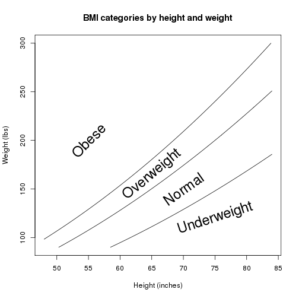
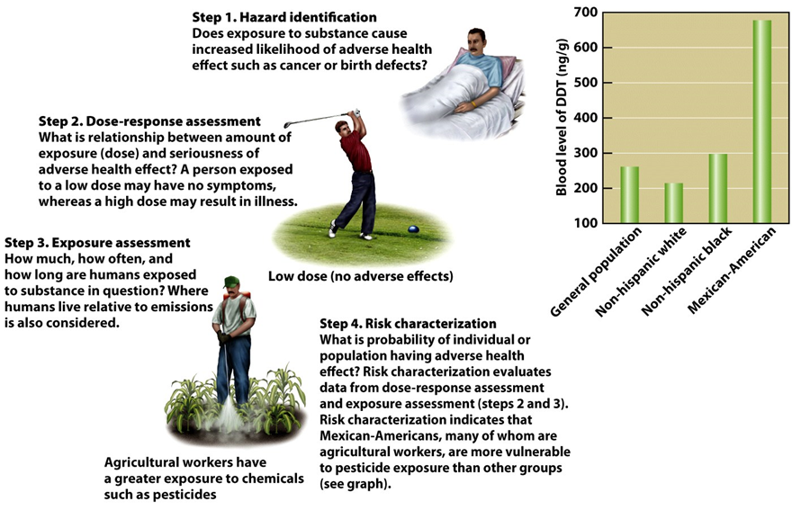
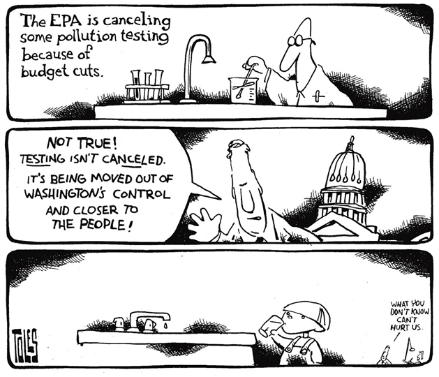
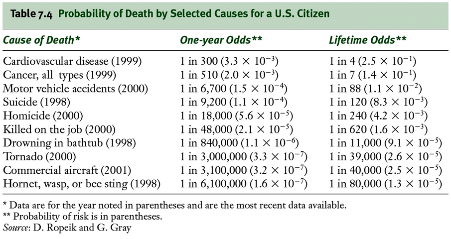

Ecotoxicology
========================================================
author: Marc Los Huertos
date: April 19, 2017
autosize: true

What is Ecotoxicology?
========================================================

For more details on authoring R presentations please visit <https://support.rstudio.com/hc/en-us/articles/200486468>.

- Bullet 1
- Bullet 2
- Bullet 3

What is Human Health?
========================================================

Two indicators of Human Health

-Life expectancy: How long people are expected to live?

-Infant mortality: How many children die before age of 1 year?

NOTE: Vary greatly between countries

e.g. Developed versus developing countries

***


Health Issues in Developed Countries
========================================================
+ Premature deaths caused by lifestyle

- Poor diet

- Lack of exercise

- Smoking

***

Obesity is big problem, where we measure "health" using the Body Mass Index: 

BMI = Mass (kg)/Height^2 (m) = 740 * (Mass (lb))/ (Height^2 (in))


+ < 18.5 is underweight
+ 18.5-24.9 is healthy weight
+ 25-29 is overweight
+ > 30 is obese


Example of BMI
========================================================


```r
BMI = 740 * 180/(5*12+11)^2; round(BMI, 1)
```

```
[1] 26.4
```

BMI Contours
========================================================



Regional BMIs
=======================================================


Health Issues in Developing Countries
=======================================================
- Malnutrition, unsafe water, poor sanitation

- Life Expectancy 

-- Overall is 65 years

-- Very poorest developing countries = 45 years

- Most of these countries have high AIDS epidemics

*** 
Childhood mortality is high (18% of deaths)

- Diarrheal diseases

- Malnutrition

- Malaria

- AIDS/HIV

Toxicology
=================================================
+ Toxicology is the study of the effect of toxicants on the human body

- Toxicant- chemical with adverse human health effects

-- Acute toxicity: Adverse effects occur within a short period after exposure to toxin

-- Chronic toxicity: Adverse effects occur some time after exposure, or after prolonged exposure to toxin
Symptoms often mimic other diseases- hard to assess source

Exposure Studies
=====================================================
Most studies look at one chemical, but humans tend to be exposed to chemical mixtures
Ex: automobile exhaust
Chemical Mixtures interact by

Additivity

Synergy

Antagonism

These studies are expensive and take a while to complete

Ecotoxcology
=======================================================

Dilution Paradigm is not valid
“Dilution is the solution to pollution”
Boomerang Paradigm is accepted
“What you throw away can come back and hurt you”
Ecotoxicology
The study of contaminants in the biosphere and their harmful effects on ecosystems
Helps policy makers determine costs and benefits of industrial and technological “advances”
And how they often adversely effect ecosystems

Case Study
===================================================
Land based nutrient and pollution runoff into ocean is affecting microorganisms

Ex: Red Tide
Red pigmented poisonous algal blooms
Toxins kill off fish and make humans sick

Risk Assessment
===================================================
Risk- probability that a particular adverse effect will result from some exposure or condition
We assess risk daily with four steps
Hazard identification
Dose response assessment
Exposure assessment
Risk characterization

Risk Assessment
==================================================



EPA
========================================================
***


Probability of Death
=========================================================



Assessment Challenges
=========================================================
Difficult to assess because effect occur at wide range of scales
Individual plants and animals
Ecological communities over wide regions
Human-induced environmental stressors also range greatly
Good to bad
Acceptable to unacceptable
There is a need to quantify risks to the environment

Snake River Ecosystem in Southern Idaho
=================================================
* River provides hydroelectric power and water for irrigation
* Human use causes reduced flow, elevated water temperature and nutrient enrichment
+ Results in decrease in fish, algal blooms

# Ecol. Risk Assessment
Used to help government and locals set priorities to manage and protect ecosystem


